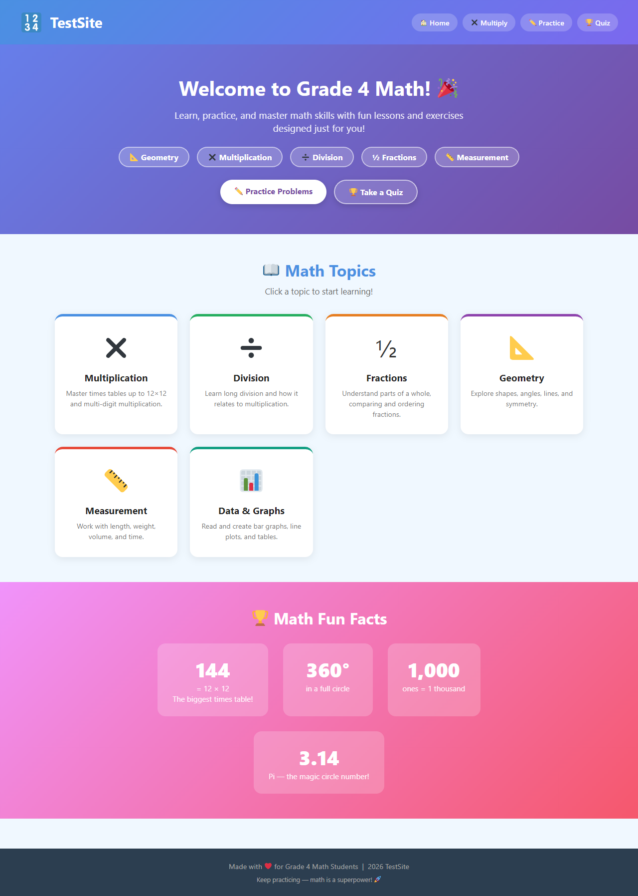
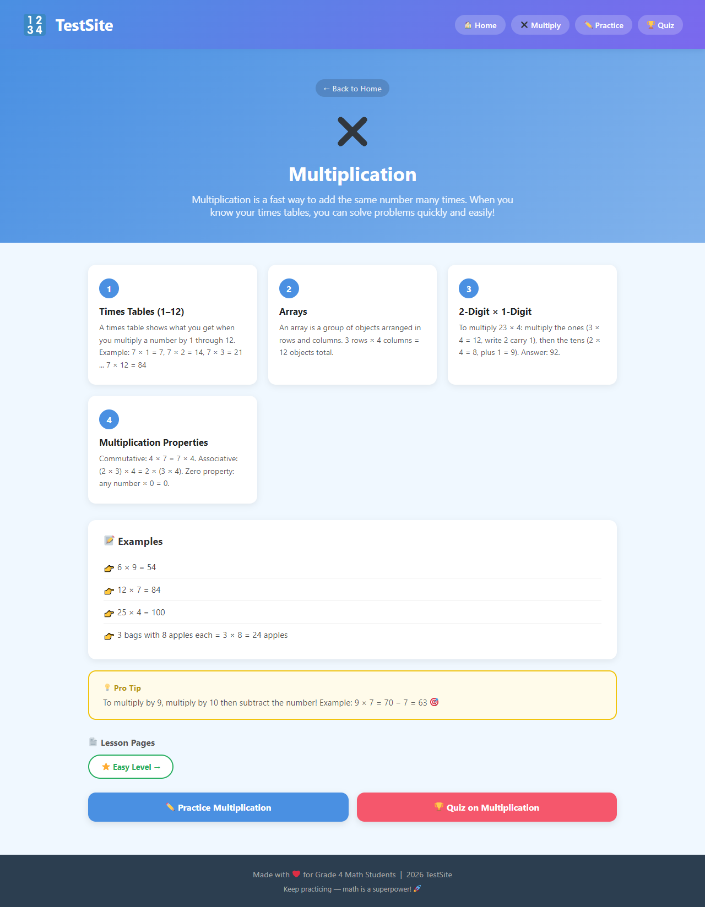
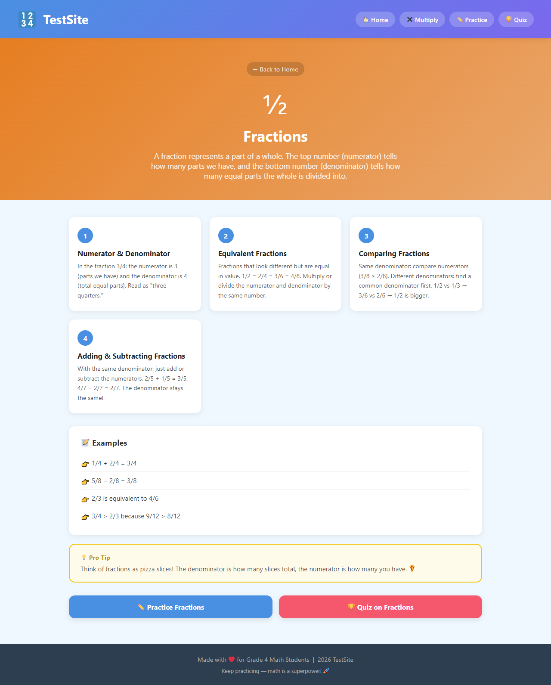
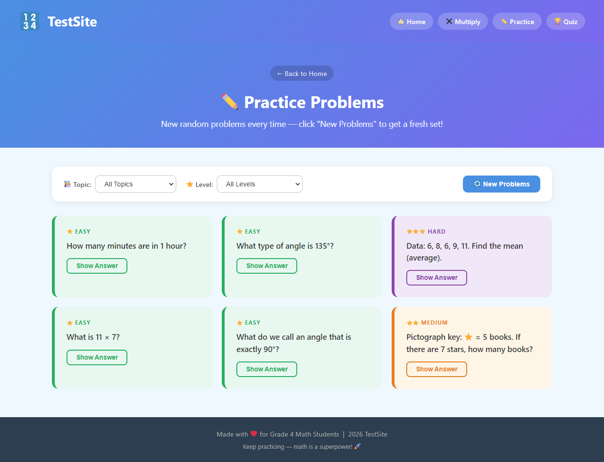
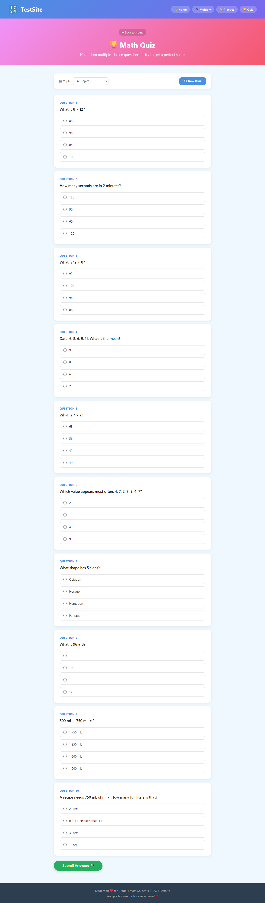
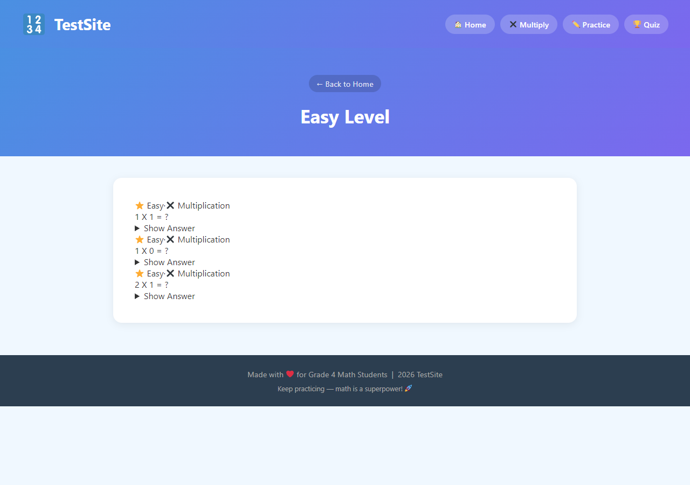

# Grade 4 Math — WordPress Site

A custom WordPress site built as an interactive math learning platform for Grade 4 students.

## Screenshots

### Homepage


### Topic Page — Multiplication


### Topic Page — Fractions


### Practice Problems


### Quiz


### Easy Level Page — Math Problem Block (Gutenberg)
> Each problem card is a custom Gutenberg block. Students can type their answer directly, then reveal the correct answer.



---

## Features

- **6 Math Topics** — Multiplication, Division, Fractions, Geometry, Measurement, Data & Graphs
- **Random Practice Problems** — 90+ problems across all topics, filtered by topic and difficulty
- **Random Quiz** — 10 multiple-choice questions per session with live scoring
- **Custom Gutenberg Block** — "Math Problem" block with:
  - Question field
  - Student answer input (students type directly on the page)
  - Hidden correct answer revealed via Show/Hide button
  - Difficulty level and topic badge
  - Optional hint
- **Fully custom theme** — built from scratch with PHP, CSS, and JavaScript

## Tech Stack

- **WordPress** (PHP)
- **Custom Theme** — PHP, CSS, vanilla JavaScript
- **Custom Gutenberg Block** — React, `@wordpress/scripts` (Webpack)
- **Local development** — LocalWP

## Project Structure

```
wp-content/
├── themes/
│   └── grade4math/           # Custom WordPress theme
│       ├── style.css          # Theme styles
│       ├── functions.php      # Theme setup + script enqueue
│       ├── index.php          # Main router (?page= query param)
│       ├── page.php           # WordPress page template
│       ├── header.php
│       ├── footer.php
│       ├── inc/
│       │   ├── home.php       # Homepage — topic cards + fun facts
│       │   ├── topic.php      # Topic lesson pages (concepts + examples)
│       │   ├── practice.php   # Random practice problems (filter by topic/level)
│       │   └── quiz.php       # Random multiple-choice quiz with scoring
│       └── js/
│           └── grade4math.js  # Question banks (90+ problems, 72+ quiz questions)
│
└── plugins/
    └── grade4math-blocks/     # Custom Gutenberg block plugin
        ├── grade4math-blocks.php
        ├── src/
        │   ├── block.json     # Block metadata + attributes
        │   ├── index.js       # Block registration + deprecated handler
        │   ├── edit.js        # Editor component (React)
        │   ├── save.js        # Frontend HTML output
        │   └── style.css      # Block styles (editor + frontend)
        └── build/             # Compiled output (wp-scripts / Webpack)
```

## Setup Instructions

1. Install [LocalWP](https://localwp.com/) and create a new site
2. Clone this repo into the `wp-content/` folder inside your site's `app/public/`
3. In **WP Admin → Appearance → Themes** → Activate **Grade 4 Math**
4. In **WP Admin → Plugins** → Activate **Grade 4 Math Blocks**
5. Build the Gutenberg block:
   ```bash
   cd plugins/grade4math-blocks
   npm install
   npm run build
   ```
6. Visit your local site

## Updating Screenshots

Screenshots are auto-generated using Puppeteer. From the project root:
```bash
npm run screenshot
```
